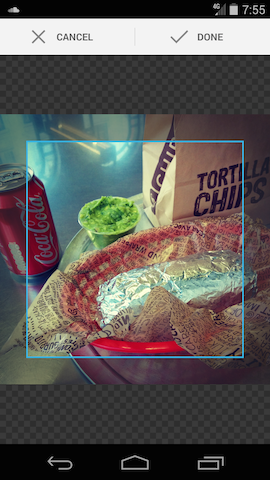

An Android library project to provide a simple image cropping `Activity`. This cropping functionality can be easily used by other android applications wherever applicable.

## Goals

* Simple UI
* Backwards compatible to Gingerbread
* Simple builder for configuration
* Example project
* More tests, less unused complexity

## Usage

First, declare `CropImageActivity` in your manifest file:

`<activity android:name="com.vklabs.android.crop.CropImageActivity" />`

#### Crop

`new Crop(inputUri).output(outputUri).asSquare().start(activity)`

Listen for the result of the crop (see example project if you want to do some error handling):

    @Override
    protected void onActivityResult(int requestCode, int resultCode, Intent result) {
        if (requestCode == Crop.REQUEST_CROP && resultCode == RESULT_OK) {
            doSomethingWithCroppedImage(outputUri);
        }
    }

#### Pick

The library provides a utility method to start an image picker:

`Crop.pickImage(activity)`

## How does it look?

